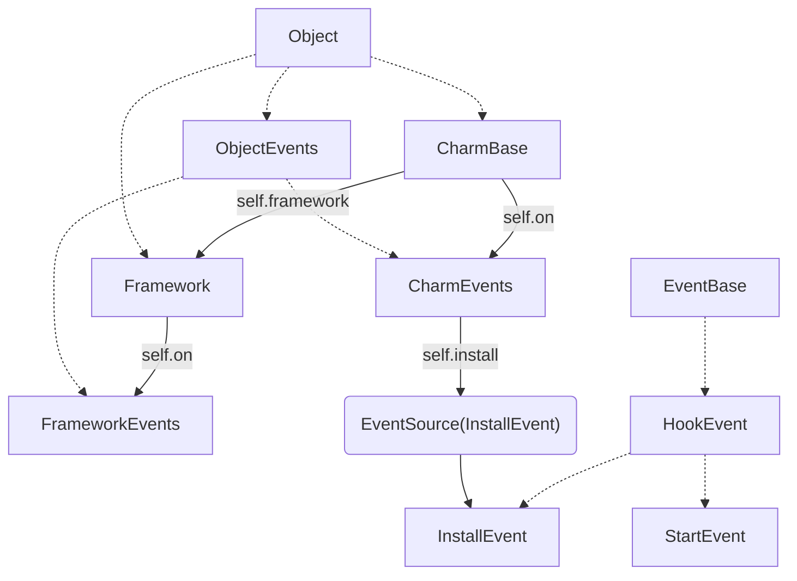
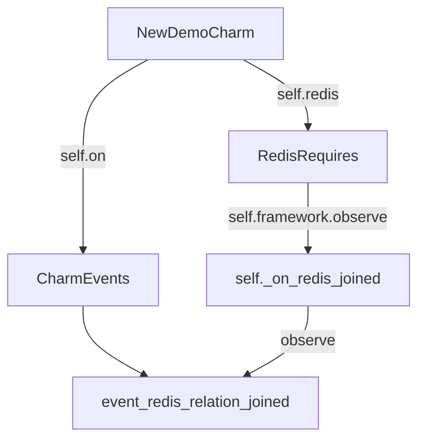

# Integration, Relation

> Before juju v.3.0, ‘integrations’ were called ‘relations’. Remnants of this persist in the names, options, and output of certain commands, and in integration event names.


The definitions of relations are handled through interfaces, which are “loosely typed”, meaning there is no de-facto specification for:

- What information a relation must send/receive
- What actions are to be taken with data sent/received over the wire


In this chapter we will compare two version of implementation of redis interface in reactive and operator:

- https://github.com/canonical/interface-redis.git
- https://charmhub.io/redis-k8s/libraries/redis

## Databag


> https://juju.is/docs/sdk/integration#heading--integration-data

The same part:

*Juju will store unit's local data in sqlite and publish it to remote controller's databag if the data has been modified with hook-tool relation-set*

## Reactive

If you take a look at the docstring of class Endpoint in charms.reactive. It mention that there are four flags are automatically managed for each endpoint. Endpoint handlers can react to these flags using the decorators.

- **endpoint.{endpoint_name}.joined**
- **endpoint.{endpoint_name}.changed**
- **endpoint.{endpoint_name}.changed.field**
- **endpoint.{endpoint_name}.departed**

[provides.py](https://github.com/canonical/interface-redis/blob/main/provides.py)

```python
from charms.reactive import Endpoint


class RedisProvides(Endpoint):

    def configure(self, host, port, password=None):
        """
        Configure the host-port relation by providing a port and host.
        """
        ctxt = {'host': host, 'port': port}
        if password:
            ctxt['password'] = password
        for relation in self.relations:
            relation.to_publish.update(ctxt)
```


[requires.py](https://github.com/canonical/interface-redis/blob/main/requires.py)

```python
from charms.reactive import when, when_not
from charms.reactive import set_flag, clear_flag
from charms.reactive import Endpoint


class RedisRequires(Endpoint):

    @when('endpoint.{endpoint_name}.joined')
    def joined(self):
        if any(unit.received['port'] for unit in self.all_joined_units):
            set_flag(self.expand_name('available'))

    @when('endpoint.{endpoint_name}.changed')
    def changed(self):
        if any(unit.received['port'] for unit in self.all_joined_units):
            set_flag(self.expand_name('available'))
        clear_flag(self.expand_name('changed'))

    @when_not('endpoint.{endpoint_name}.joined')
    def broken(self):
        clear_flag(self.expand_name('available'))

    def relation_data(self):
        """
        Get the list of the relation info for each unit.
        Returns a list of dicts, where each dict contains the host (address)
        and the port (as a string), as well as
        the relation ID and remote unit name that provided the site.
        For example::
            [
                {
                    'host': '10.1.1.1',
                    'port': '80',
                    'relation_id': 'reverseproxy:1',
                    'unit_name': 'myblog/0',
                },
            ]
        """
        units_data = []
        for relation in self.relations:
            for unit in relation.joined_units:
                host = unit.received['host']
                port = unit.received['port']
                password = unit.received['password']
                if not (host and port):
                    continue
                ctxt = {'host': host, 'port': port}
                if password:
                    ctxt['password'] = password

                units_data.append(ctxt)
        return units_data
```

> Both requires and provides call charmhelpers.core.unitdata in the backend.
>
> https://github.com/juju-solutions/charms.reactive/blob/1db5d0ae59ea5e1673173a1c5ed649328156b2d1/charms/reactive/endpoints.py#L21


## Operator

[redis.py](https://github.com/canonical/redis-k8s-operator/blob/main/lib/charms/redis_k8s/v0/redis.py)

```python
import logging
import socket

from ops.charm import CharmEvents
from ops.framework import EventBase, EventSource, Object

# The unique Charmhub library identifier, never change it.
LIBID = "fe18a608cec5465fa5153e419abcad7b"

# Increment this major API version when introducing breaking changes.
LIBAPI = 0

# Increment this PATCH version before using `charmcraft publish-lib` or reset
# to 0 if you are raising the major API version.
LIBPATCH = 3

logger = logging.getLogger(__name__)


class RedisRelationUpdatedEvent(EventBase):
    """An event for the redis relation having been updated."""


class RedisRelationCharmEvents(CharmEvents):
    """A class to carry custom charm events so requires can react to relation changes."""
    redis_relation_updated = EventSource(RedisRelationUpdatedEvent)


class RedisRequires(Object):
    def __init__(self, charm, _stored):
        """A class implementing the redis requires relation."""
        super().__init__(charm, "redis")
        self.framework.observe(charm.on.redis_relation_joined, self._on_relation_changed)
        self.framework.observe(charm.on.redis_relation_changed, self._on_relation_changed)
        self.framework.observe(charm.on.redis_relation_broken, self._on_relation_broken)
        self._stored = _stored
        self.charm = charm

    def _on_relation_changed(self, event):
        """Handle the relation changed event."""
        if not event.unit:
            return

        hostname = event.relation.data[event.unit].get("hostname")
        port = event.relation.data[event.unit].get("port")
        self._stored.redis_relation[event.relation.id] = {"hostname": hostname, "port": port}

        # Trigger an event that our charm can react to.
        self.charm.on.redis_relation_updated.emit()

    def _on_relation_broken(self, event):
        """Handle the relation broken event."""
        # Remove the unit data from local state.
        self._stored.redis_relation.pop(event.relation.id, None)

        # Trigger an event that our charm can react to.
        self.charm.on.redis_relation_updated.emit()


class RedisProvides(Object):
    def __init__(self, charm, port):
        """A class implementing the redis provides relation."""
        super().__init__(charm, "redis")
        self.framework.observe(charm.on.redis_relation_changed, self._on_relation_changed)
        self._port = port
        self._charm = charm

    def _on_relation_changed(self, event):
        """Handle the relation changed event."""
        event.relation.data[self.model.unit]['hostname'] = self._get_master_ip()
        event.relation.data[self.model.unit]['port'] = str(self._port)
        # The reactive Redis charm also exposes 'password'. When tackling
        # https://github.com/canonical/redis-k8s/issues/7 add 'password'
        # field so that it matches the exposed interface information from it.
        # event.relation.data[self.unit]['password'] = ''

    def _bind_address(self, event):
        """Convenience function for getting the unit address."""
        relation = self.model.get_relation(event.relation.name, event.relation.id)
        if address := self.model.get_binding(relation).network.bind_address:
            return address
        return self.app.name

    def _get_master_ip(self) -> str:
        """Gets the ip of the current redis master."""
        return socket.gethostbyname(self._charm.current_master)
```

So if you take a look at the source code there are multiple terms here. *EventBase*, *CharmEvents*, and *Object*.
Let me explain those terms meaning, we can found those inheritance from the source code: 



*How event handler handling the events?*

Every Object belongs to exactly one framework. Every object has a parent, which might be a framework.
Operator track a *path to object", which is the path to the parent, plus the object's unique identifier.
Event handlers use this identity to track the destination of their events, and the Framework used this id to track persisted state between event executions.


```python
from charms.redis_k8s.v0.redis import RedisRequires

class NewDemoCharm(CharmBase):


    def __init__(self):
        self._stored.set_default(redis_relation={})
        self.redis = RedisRequires(self, self._stored)
```



What it actually do is registering event handler to parent's CharmEvents.

## Summary

- The same part: **lifecycle**, **hook-tool: relation-***
- Different part:
    - **storage**
        - reactive use charmhelpers to handle local's data in sqlite
        - operator has it in the library: https://github.com/canonical/operator/blob/main/ops/storage.py
    - Different syntax
        - reactive is based on **flags**. User need to define the handlers for those flags.
        - Operator is based on **object**. User need to create a Object which parent is the main charm. And **observe** the event handle to the main charm's **CharmEvents**.
