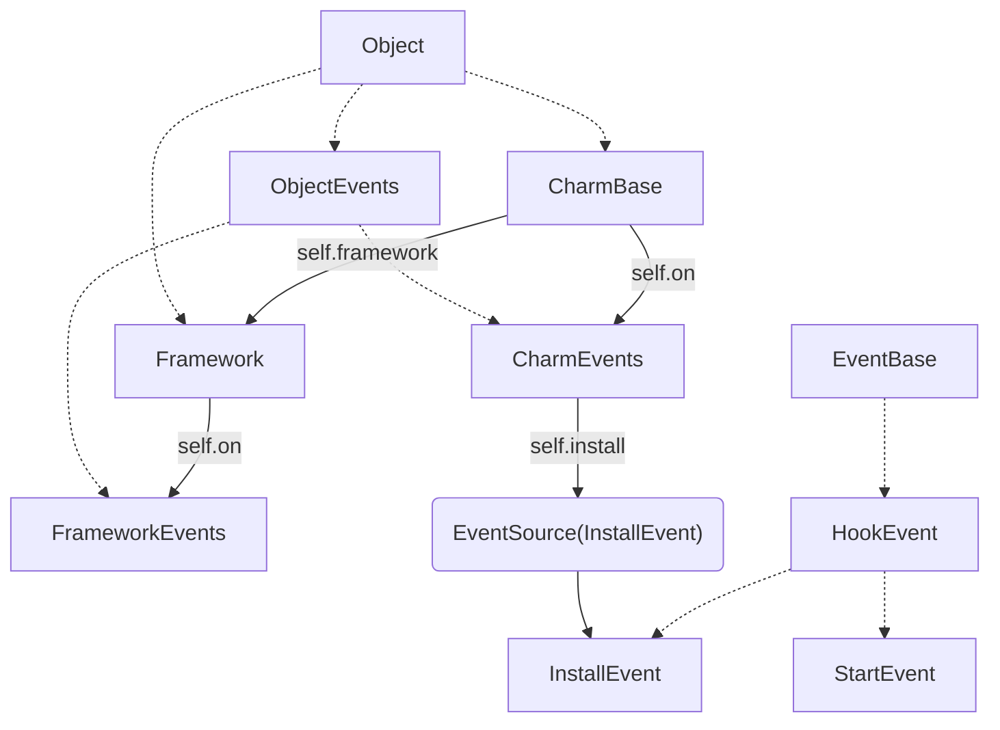

# Operator architecture

*How event handler handling the events?*

Every Object belongs to exactly one framework. Every object has a parent, which might be a framework.
Operator track a *path to object", which is the path to the parent, plus the object's unique identifier.
Event handlers use this identity to track the destination of their events, and the Framework used this id to track persisted state between event executions.
